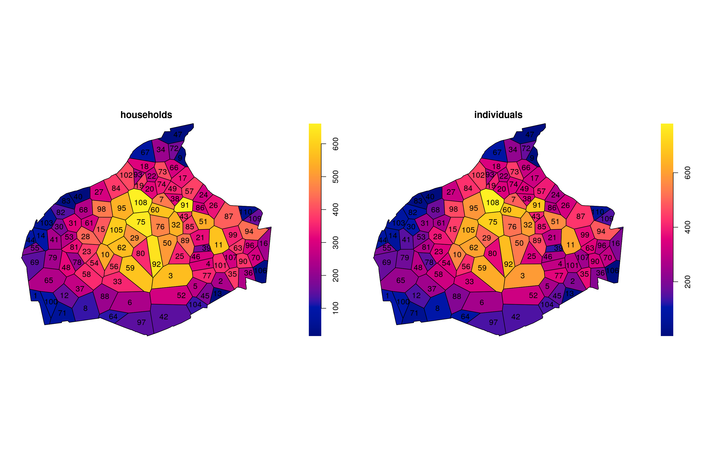
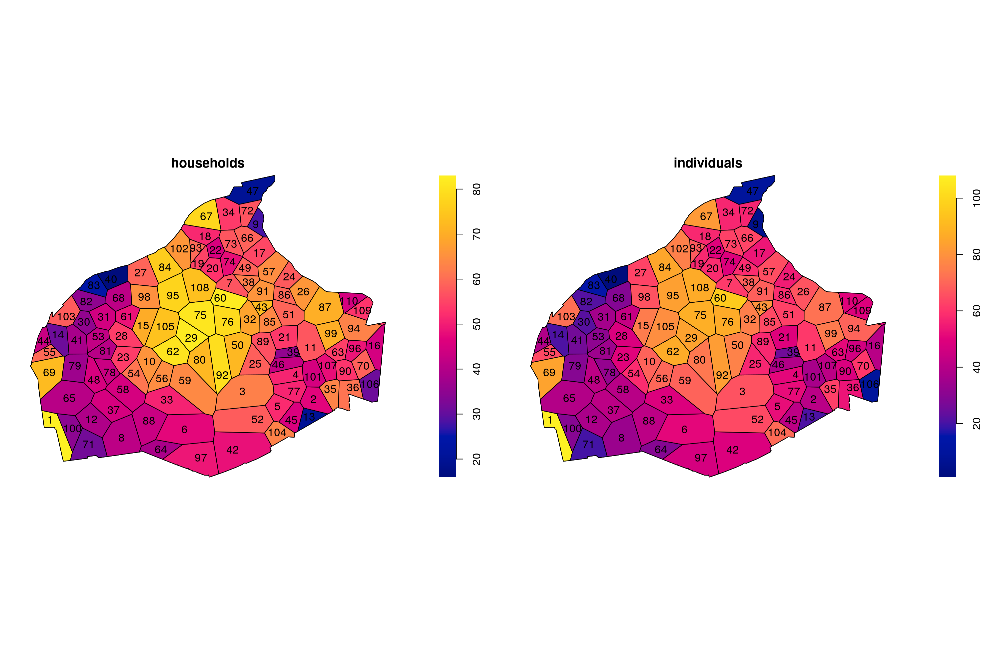

Introduction to aggregation tessellations with aggrtess
================
Ege Rubak

## Motivation

When publishing data from official statistics agencies such as *Danmarks
Statistik* there is a limit on the spatial resolution that can be used
to protect the privacy of individuals. In case of Danmarks Statistik the
rule is that you can only publish something for an area that contains at
least 50 households and at least 100 individuals. This package makes an
automatic division of a given region into a collection of subregions
that satisfies this constraint.

## Example data

In this introduction we use artificially generated data based on the
address locations in the municipality Frederiksberg Kommune in Denmark.
The municipality boundary and the address locations are correct, but the
attached number of households and persons at each address is artificial.

The `aggrtess` package uses `spatstat` classes and methods and the data
needs to be supplied as a marked planar point pattern `ppp`.

The example data is supplied with the package as the dataset `frb`.

``` r
library(aggrtess)
frb
```

    ## Marked planar point pattern: 9430 points
    ## Mark variables: households, individuals 
    ## window: polygonal boundary
    ## enclosing rectangle: [719497.1, 723631] x [6174592, 6178107] units

``` r
head(cbind(coords(frb), marks(frb)))
```

    ##          x       y households individuals
    ## 1 722458.7 6176291          1           1
    ## 2 722450.0 6176294          2           2
    ## 3 722012.6 6177897          1           2
    ## 4 722563.2 6175971          1           1
    ## 5 722573.4 6176012          1           1
    ## 6 722569.3 6175999          1           2

A plot of the unmarked data shows the boundary and the address
locations:

``` r
plot(unmark(frb), main = "")
```

<!-- -->

**Note:** It is important that there are no duplicated points in the
point pattern. If your data has duplicated points these should be
aggregated such that two points at the same location with attributes
`x_1` and `x_2` are reduced to a single point at that location with
attributes `x_1+x_2`. To aggregate attributes for a big dataset use the
supplied function `aggregate_duplicates` which requires the suggested R
package `data.table`.

## Aggregation tessellation

The core of the package is the concept of an aggregation tessellation.
This is a subdivision of the study region into polygonal tiles (a
tessellation), and then the attribute values are aggregated for all the
points located inside each tile. The tessellation is defined by using a
collection of tile centers to make a Voronoi/Dirichlet tessellation.
Thus to define a aggregation tessellation we only need a set of centers
which can be defined in several ways using `make_aggrtess_centers`. For
example:

``` r
set.seed(42) # For reproducibility
cent <- make_aggrtess_centers(X = frb, centers = "index_shift", target = c(50, 100))
```

The algorithm first decides on the number of tiles based on the input
marked point pattern `X` and the target vector `target` (and `adjust`).
Based on the total of the attributes (households and individuals) over
the region we can calculate approximately how many tiles are needed to
have the `target` number of attributes in each tile. The needed number
of tiles is calculated based on each attribute and then the smallest one
is used. This rule can be adjusted by `adjust`, so e.g. `adjust=2`
effectively doubles the target so half as many tiles are used. After
deciding the number of tiles the centers are distributed according to
the string `centers`. For example rectangular or hexagonal grids can be
used where either the center or a random sampled location from `X`
inside each grid cell is chosen as the tile center. Other options
include sampling based on the index in the point pattern or random
thinning of the point pattern.

With the centers at hand an aggregation tessellation is constructed with
the `aggrtess` command:

``` r
x <- aggrtess(frb, centers = cent, target = c(50, 100))
plot(x)
```

<!-- -->

    ## Tessellation
    ## Tiles are irregular polygons
    ## 168 tiles (irregular windows)
    ## Tessellation has 2 columns of marks: 'households' and 'individuals'
    ## window: polygonal boundary
    ## enclosing rectangle: [719497.1, 723631] x [6174592, 6178107] units

**NOTE:** The resulting aggregation tesselllation typically doesn’t
satisfy the target constraints at this point. This is handled below.

## Deleting tiles (pruning the tessellation)

In our example several tiles in the bottom have too few households (and
individuals) compared to the target.

To delete tile 134 we simply do:

``` r
x <- delete_tile(x, 134)
plot(x)
```

<!-- -->

    ## Tessellation
    ## Tiles are irregular polygons
    ## 167 tiles (irregular windows)
    ## Tessellation has 2 columns of marks: 'households' and 'individuals'
    ## window: polygonal boundary
    ## enclosing rectangle: [719497.1, 723631] x [6174592, 6178107] units

Now the tiles around the previous tile 134 have all expanded (noticed
all tile ids change when the tessellation is updated). To continue the
process until all tiles are above the target we use `prune_aggrtess`
(this probably takes some minutes depending on your machine):

``` r
y <- prune_aggrtess(x)
plot(y)
```

<!-- -->

    ## Tessellation
    ## Tiles are irregular polygons
    ## 109 tiles (irregular windows)
    ## Tessellation has 2 columns of marks: 'households' and 'individuals'
    ## window: polygonal boundary
    ## enclosing rectangle: [719497.1, 723631] x [6174592, 6178107] units

## Splitting tiles (filling the tessellation)

At this point the tessellation satisfies the requirements set in the
target, but there may big tiles with large counts of the attributes. We
can try to split e.g. tile 96 or the far right using `split_tile`:

``` r
set.seed(4242) # For reproducibibily
z <- split_tile(y, 96)
z
```

    ## Aggregation tessellation with:
    ## 9430 points split into 110 tiles.
    ## Marks being aggregated: households,individuals
    ## Aggregation target: 50,100

``` r
plot(z)
```

<!-- -->

    ## Tessellation
    ## Tiles are irregular polygons
    ## 110 tiles (irregular windows)
    ## Tessellation has 2 columns of marks: 'households' and 'individuals'
    ## window: polygonal boundary
    ## enclosing rectangle: [719497.1, 723631] x [6174592, 6178107] units

To automatically choose tiles for splitting we need to know which one
potentially could be split, which we do the following way.

For each tile we define the neighbourhood as the tile itself together
with the bordering tiles. The neighbourhood of tile 36 in the bottom
right hand corner of `z` above is: \(\{36,35,90,70,106\}\). Based on the
neighbourhood we can calculate the minimum needed counts to have a
neighbourhood of this size. A neighbourhood of size 5 requires a count
of at least `5*target`. We define the excess as the amount the actual
count in the neighbourhood exceeds this minimum. If the excess is larger
than the target there could potentially be introduced an extra tile in
the neighbourhood and we suggest to split the center tile (36 in this
case). An adjustment parameter is provided to make sure the excess is
somewhat above the target so the split is not too difficult.

The function `fill_aggrtess` runs trough the tessellation in order from
the largest excess and tries to split each tile with excess larger than
`adjust*target`. If it is succesfull a new tessellation is generated and
the procedure is restarted. It will try a total of `max_tiles` tiles and
each possible tile it will suggest to split at most `max_tries` times.
Please note that this can run for a long time if `max_tiles` and
`max_tries` are big (the example below runs for a few minutes on my
laptop):

``` r
set.seed(424242) # For reproducibibily
autofill <- fill_aggrtess(z, max_tiles = 150)
autofill
```

    ## Aggregation tessellation with:
    ## 9430 points split into 136 tiles.
    ## Marks being aggregated: households,individuals
    ## Aggregation target: 50,100

``` r
plot(autofill)
```

<!-- -->

    ## Tessellation
    ## Tiles are irregular polygons
    ## 136 tiles (irregular windows)
    ## Tessellation has 2 columns of marks: 'households' and 'individuals'
    ## window: polygonal boundary
    ## enclosing rectangle: [719497.1, 723631] x [6174592, 6178107] units

If we want to try to split a specific tile we may still do so:

``` r
final <- split_tile(autofill, 1)
final
```

    ## Aggregation tessellation with:
    ## 9430 points split into 137 tiles.
    ## Marks being aggregated: households,individuals
    ## Aggregation target: 50,100

``` r
plot(final)
```

<!-- -->

    ## Tessellation
    ## Tiles are irregular polygons
    ## 137 tiles (irregular windows)
    ## Tessellation has 2 columns of marks: 'households' and 'individuals'
    ## window: polygonal boundary
    ## enclosing rectangle: [719497.1, 723631] x [6174592, 6178107] units

## Exporting to `sf` and viewing with `mapview`

To export to `sf` format use `aggrtess2sf`, and optionally visualize the
results with `mapview` (results not shown here):

``` r
final_sf <- aggrtess2sf(final)
mapview::mapview(final_sf, zcol = c("households", "individuals"))
```
